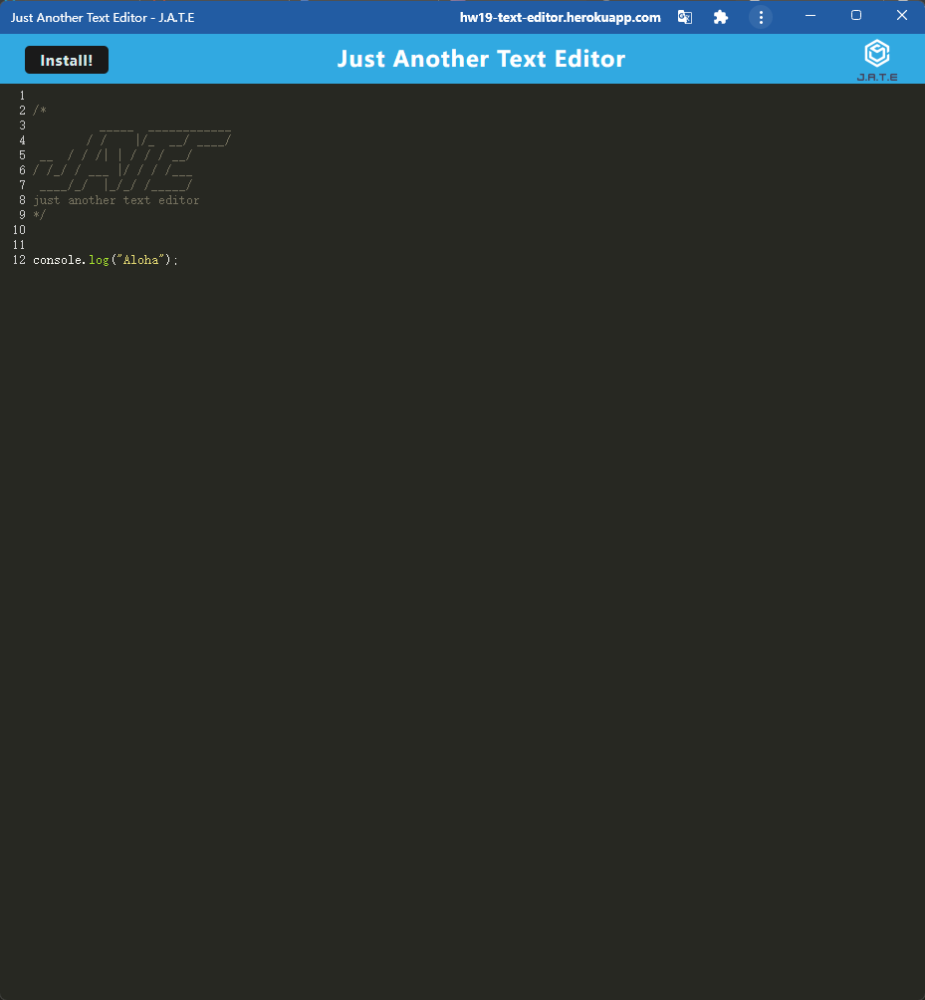
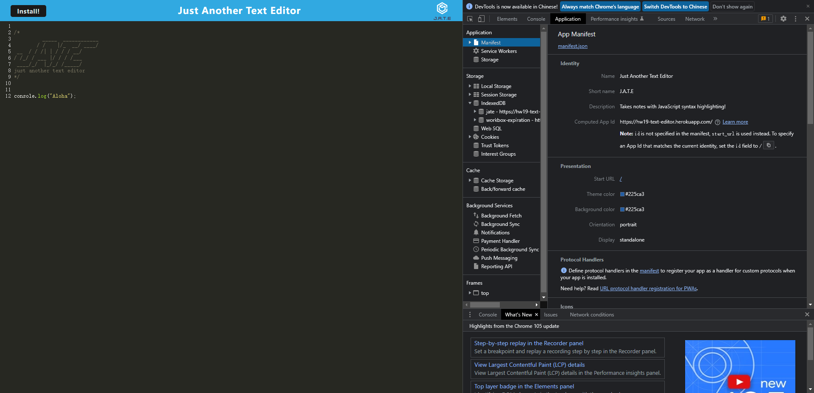
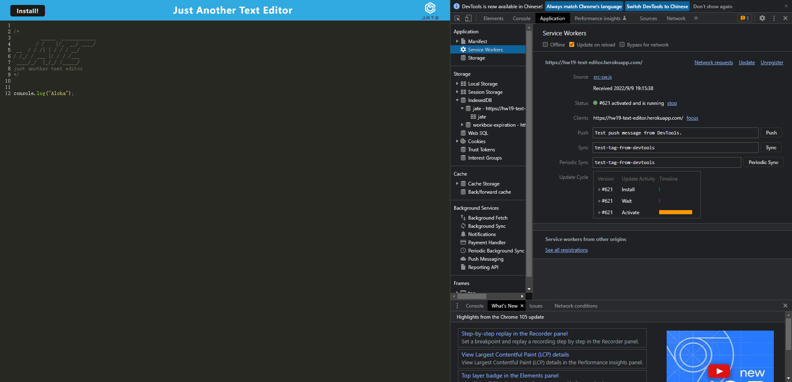
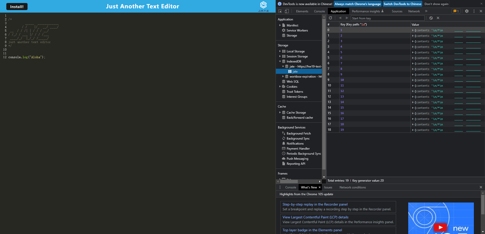

# UCSD_HW19_Progressive-Web-Applications-PWA-
In this unit, we would learn about Progressive Web Apps (PWAs), which blend the benefits of a traditional browser experience with those of a mobile application. PWAs use the Service Worker and Cache APIs to cache assets and API responses, which ensures that the application will continue to work without an internet connection.

## User History

```
AS A developer
I WANT to create notes or code snippets with or without an internet connection
SO THAT I can reliably retrieve them for later use
```

## Related Links
* The Github Repository link: [My Github](https://github.com/hengyu89/UCSD_HW19_Progressive-Web-Applications-PWA-)

* The program showed as Heroku: [Demo by Heroku](https://hw19-text-editor.herokuapp.com/)

## Usage

* JavaScript
* PWA
* npm
* webpack
* Workbox
* IndexedDB
* Heroku

## What I've done

* This program is a text editor that users could write down any notes in the application. And it's automatically saved each time you don't focus on this window.

* This application could work without internet connection, and is able to download to the desktop for usage.

## Screenshots








